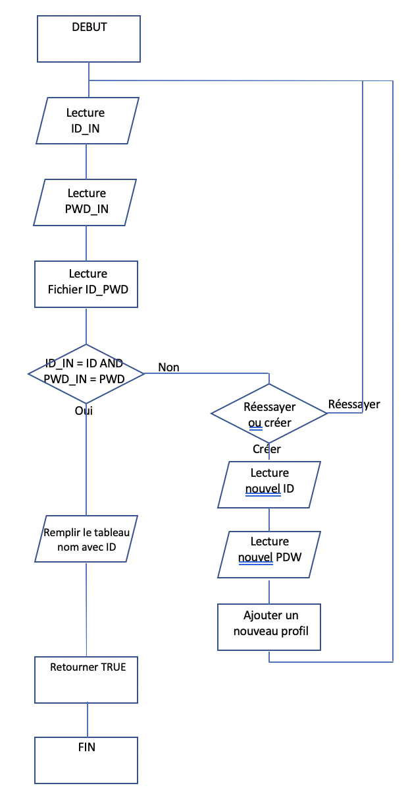
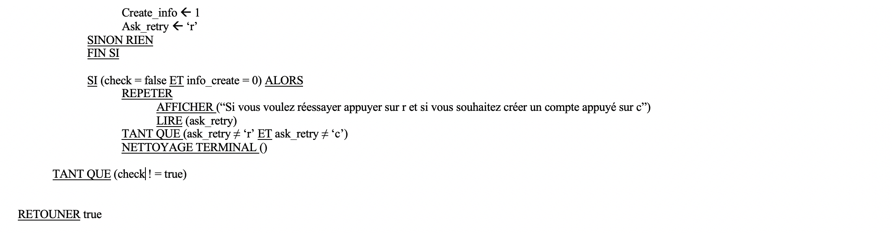

# Projet-IFB

Ce projet est universitaire .

Notre projet consiste en une application qui va aider les agents de ménages dans l’organisation des taches. Celle-ci va permettre d’optimiser le nettoyage des salles en générant un planning de nettoyage chaque jour en fonction de l’occupation des salles pour chaque agent de ménage.
Par exemple l’agent de ménage rentre son identifiant et on lui génère la liste des salles qu'il doit nettoyer avec les horaires. Cela va non seulement optimiser le nettoyage mais aussi diminuer le temps de travail.

## Les fonctions : 
- Identification de l’agent :
    Dans un premier temps nous demandons à la personne son nom et son mot de passe. 

    Si la personne rentre les paramètres correspondant alors elle peut rentrer sur la plateforme dans le cas contraire on lui demande si elle veut réessayer ou si elle veut créer un compte. Si elle appuie sur « r » alors on lui redemande de rentrer son identifiant et son mot de passe. Dans le cas contraire si elle appuie sur « c » alors on lui demande un identifiant et un mot de passe qui lui permettront de se connecter. Ainsi ses nouveaux paramètres sont ajoutés sur le fichier des identifiants et on lui demande de se reconnecter pour qu’il accède à la plateforme.
    Cette fonction se nomme identification or elle ne peut fonctionner en autonomie, elle fait appel à la fonction création_agent et à la fonction de lecture_identifiant. La fonction de création d’agent permet de créer un agent dans le fichier des agents pour ensuite lui générer un emploi du temps. Pour la fonciton de lecture d’identifiants elle sert à lire tous les identifiants dans le fichier des identifiants et ensuite de remplir un tableau qui nous permet de stocker tous les agents lors de la génération ou même de l’identification.

    Pour appeler cette fonction, nous faisons : 
    
    ```C
    bool identification();
    ```

    En sortie de la fonction identification nous avons un booléen celui-ci permet dans le main.c de mettre une condition qui permet de définir l’entrée dans la plate-forme.

    Voici le fonctionnement de la fonction :

    <p align="center">
    
    </p>


 - Fonction de lecture_identifiant 

    Permet de lire dans le fichier tous les identifiants et leurs mots de passe afin de les stocker dans un tableau à deux dimensions. Ainsi de deux en deux nous avons l’identifiant et le mot de passe. Ce tableau est utilisé dans la fonction principale de l’identification c’est à dire la fonction identification. Nous ne rentrons pas ce tableau en paramètre, mais nous le définissons en extern cela signifie que toutes les fonctions peuvent y avoir accès et que nous pouvons le modifier et lire les modifications effectuées. 
    Cette fonction nous permet également de compter le nombre d’agent dans le système pour pouvoir faire la répartition des taches en fonctions du nombre d’agent disponible.  

    Cette fonction est donc activée dès le début de l’identification afin de pouvoir se connecter.

    Pour appeler cette fonction nous faisons :

    ```C
    void lecture_identifiant(int* nb_employe);
    ```
 - Fonction création_agent 

    Cette fonction est utilisée quand la personne souhaite créer un compte. On lui demande l’identifiant et le mot de passe qu’elle souhaite ajouter puis nous l’ajoutons dans le fichier dans lequel tous les agents sont répertoriés. Puis nous relançons l’identification avec la lecture du fichier et la demande des paramètres.  De plus cette fonction nous permet de créer un emploi du temps vide pour la personne et ainsi lors de la prochaine génération des emplois du temps elle se verra attribuer un emploi du temps.

    Pour appeler cette fonction nous faisons : 

    ```C
    int creation_agent(int* nb_employe);
    ```

 - Génération des emplois du temps 

    Cette fonction va nous permettre de générer pour chaque agent un emploi du temps en fonction de la disponibilité de chaque salle.
    Pour cela nous lisons le planning de chaque salle du jour actuelle au dernier jour de la semaine, nous créons deux tableaux qui permettent de stocker toutes les salles qui peuvent être nettoyées pour chaque quart d’heure d’une journée. 
    Nous savons désormais toutes les salles que nous pouvons nettoyer.

    Or maintenant nous devons choisir l’agent qui va faire la tâche. Nous souhaitions faire de la sorte que tous les agents est le plus possible le même temps de travail et le même taux de malchance. 
    Cette malchance est calculée de manière à ce que la personne quand elle commence tôt par exemple entre 8h et 9h on lui ajoute 2 points de malchance. On fait de même pour chaque agent de manière dégressive jusqu’à midi et nous inversons symétriquement pour l’après-midi.
    Donc quand nous décernons une tache à un agent nous lui ajoutons dans le tableau des malchances le bonus supplémentaire. Donc quand nous devrons choisir le prochain agent nous prendrons celui qui à le plus petit temps de travail et celui qui a le plus petit point de malchance.
    Si plusieurs personnes ont le même point de malchance alors nous choisissons aléatoirement parmi ces agents une personne qui va faire la tâche. 

    Cet algorithme nous permet d’avoir une répartition du travail qui est primordiale pour une bonne entente de l’équipe et un travail efficace de tous les agents. 

    Toute cette partie de choix ce fait dans une fonction qui se nomme agents_motif. Nous retournons un entier qui correspond à l’index de l’agent. 

    Cela nous permet ainsi de mettre en marche la fonction d’ajout de tache. Celle-ci permet de créer l’emploi du temps de la personne en fonction de la salle, de l’heure, de la minute. Cette fonction lit l’emploi du temps actuel de la personne et rajoute la nouvelle tâche dans l’emploi du temps. Pour faire cela on lit l’emploi du temps actuel que nous stockons dans un tableau, à ce tableau nous ajoutons la nouvelle tâche à faire.

    Une fois que toutes les taches sont distribuées alors toutes les personnes peuvent avoir accès à leur emploi du temps en allant le chercher dans le dossier des emplois du temps.

 - Recherche de salle

    La fonction recherche_salle permet de connaître la disponibilité de la salle en fonction des paramètres entrés. Nous avons comme autres paramètres l’étage, le numéro de la salle, le jour, l’heure et les minutes en quart d’heure.
    
    Cette fonction utilise des entiers pour l’etage, le numero_salle , l’heure, la minute et un caractère pour le jour et retourne un entier. Les minutes sont associées à 0 ;15 ;30 ;45. On s’intéresse donc au quart d’heure.
    Le résultat sera un entier car elle va lire la disponibilité de la salle et en fonction de cela elle va retourner une valeur (0,1,2,3).

    Par exemple :

    |Minutes | 00  | 15  | 30  | 45  |
    | ---    | --- | --- | --- | --- |
    |8h      | 3  | 0   | 0    | 0   |
    |10h     | 0  | 1   | 0    | 1   |
    |11h     | 1  | 0   | 0    | 1   |
    |12h     | 0  | 1   | 1    | 1   |
    |13h     | 1  | 1   | 0    | 1   |
    |14h     | 0  | 1   | 0    | 1   |
    |15h     | 0  | 0   | 0    | 0   |
    |16h     | 1  | 1   | 1    | 1   |
    |17h     | 0  | 1   | 0    | 0   |
    |18h     | 0  | 1   | 0    | 1   |

    La valeur 0 étant le code pour dire que la salle est à faire, la valeur 1 étant le code pour dire que la salle est indisponible, la valeur 2 est le code pour dire que la salle est à faire mais qu’elle est occupée et la valeur 3 permet de dire la salle est à faire.
    Ici le tableau est composé de 4 colonnes correspondant au quart d’heure et de 3 lignes correspondant à l’étage.
    Ensuite nous avons créé une chaine caractère permettant de recevoir le numéro de la salle afin de déterminer à quelle étage on se trouve nommé :
    
    ```C
    char nb_salle[12]
    ```

    Ainsi qu’une autre chaine caractère nommé :

    ```C 
    char numero_etage[5] 
    ```
    On va convertir l’entier numéro_salle en caractère pour l’insérer dans la chaine de caractère nb_salle grâce à un sprintf.
    Ensuite on utilisera la concaténation pour décrire le chemin pour accéder au fichier .csv grâce à la fonction strcat ainsi le chemin à suivre pour accéder au fichier csv est le suivant :

    Utilisation de la boucle SI :
    Avec la boucle si on vérifie que les paramètres entrés par l’utilisateur sont les bons. C'est-à-dire que les valeurs entrées pour les minutes sont bien 00 ; 15 ; 30 ; 45 que les étages soient bien compris entre 1 et 3 et que les heures sont bien comprises entre 8 et 18 heures. 
    Si les conditions précédentes sont respectées alors le fichier csv s’ouvre.

    On a inséré dans la boucle SI une autre boucle SI qui si f est nul alors un message d’erreur est affiché via un printf.
    Après avoir ouvert le fichier, nous le lisons ligne par ligne en stockant toutes les valeurs dans le tableau d’entier DISPO_J pouvant contenir ici 40 valeurs.

    Ensuite nous avons créé la variable etat_return de type entier qui retourne l’état de la salle ou -1 s’il y a une erreur dans les données saisies.

    Ensuite nous refermons le fichier csv en utilisant la fonction Fclose(f).

    Si les conditions précédentes sont respectées alors on peut retourner la valeur de l’index qui nous donnera la position dans le tableau et donc l’état de la salle si elle est à faire, déjà faite ou occupé grâce à la formule suivante qui retourne donc notre entier :
    Index = ((heure-8)*4)+(minute/15)

    A la fin du programme on retourne donc la variable entière return_etat qui soit 0 ; 1 ; 2 ; 3 , sinon on retourne -1.

    Voici le fonctionnement de la fonction :

    <p align="center">
    
    </p>


## Les tableaux :

- Identification
    namePassBuffer est un tableau de dimension 2 qui permet d’accueillir le nom et les mots de passe de chaque agent. Nous le remplissons en lisant le fichier où sont stockés tous les ID et mots de passe des agents. Ce tableau est déclaré comme ci-dessous :

    ```C
    extern char namePassBuffer[45][20];
    ```

    Cela permet d’avoir accès au tableau dans tous les fichiers qui incluent le fichier buffet.h. Le tableau est donc modifiable et lisible. Nous déclarons le tableau global. 


    chemin_fichier est un tableau qui permet de stocker le chemin du fichier qui permet d’ouvrir le fichier correspondant à la salle à ouvrir. 

    ```C
    extern char chemin_fichier[50];
    ```

    Nous déclarons également ce tableau en global afin d’y avoir accès dans tous les fichiers, cela permet également de ne pas passer le tableau en paramètre de la fonction de lecture de fichier. 
    Nous retrouvons exactement le même type de tableau ayant le même but dans des fonction similaires, ils ne seront donc pas détaillés.

- Choix de l’agent pour la tâche

    ```C
    extern int karma[20];
    extern int temps_travail[20];
    ```

    Ces deux tableaux permettent de stockés la malchance que nous avons appelé karma et le temps de travail des agents. En parallèle nous remplissons un tableau qui stocke les index de tous les agents :

    ```C
    int agents_karma[20] = {0};
    int agents_travail[20] = {0};
    ```

    Nous le remplissons de 0 au début et après avec une boucle for nous les remplissions de 0 à nombre agent. Nous sommes donc limités à 20 agents avec ces tableaux. 

    Nous sommes obligés de faire deux tableaux car nous plaçons les index agents en fonction de leur malchance et de leur temps de travail du plus petit au plus grand ainsi après nous balayons ces tableaux et nous additions les malchance et temps de travail au fur et à mesure nous stockons 

    Ainsi après nous lisons les scores puis nous trions les scores du plus petit au plus grand en replaçant les index. Ainsi nous lisons scores si l’index 0 est différent du 1 alors l’agent sera l’index 0 su tableau des agents. S’il y a une égalité alors nous choisissons aléatoirement. 

## Algorithme d'une fonction principale

Voici l'algorithme (pseudo-code) d'une des fonctions importantes de notre projet : 

 - La fonction Identification :
        
    <p align="center">
    
    
    </p>

## Pour compiler: 
Pour compiler ce projet en ligne de commande vous devez taper :

#### gcc -g src/main.c lib/identification/identification.c lib/personnel/agents_modif.c lib/personnel/ajout_tache.c lib/recherche_salle/recherche_salle.c lib/generate_timetable/generate_timetable.c lib/Validation/validation.c lib/Validation/change_value.c lib/Validation/reinitialisation.c  -o projet.app


Très important pour faire cela vous devez faire en sorte que le .h ne soit lu qu'une seule fois donc vous devez ajouter : (exemple avec identification.h)

```C
///Tout en haut de votre .h
#ifndef IDENTIFICATION_H_INCLUDE
#define IDENTIFICATION_H_INCLUDE

....

#endif ///a la fin de votre .h

```

## IMPORTANT

- Sur Linux et MacOS : gcc -g ... -o projet.app

- Sur Windows : gcc -g ... -o projet.exe


## Doxygen

J'ai decouvert cette extension grace à Jules Topart :)

Celle-ci vous permet d'utiliser les commentaires que vous faites dans le code afin de générer une page html automatiquement cela peut donc être très utile pour faire des rapports de stage ou de la documentation ;) 

 - Pour cela vous devez aller sur le site de Doxygen <http://www.doxygen.nl/download.html> 

 Puis télécharger en fonction de votre OS le logiciel 

 - Ensuite dans Visual Code Studio Preférences/Extentions et tapez Doxygen Documentation 

 L'icône correspondante représente des lignes de code :)

Ensuite il ne vous reste plus qu'à commenter et ouvrir le logiciel suivre les instructions qui vous sont demandées et enjoy 

## Lien vers site 

Notre page web : <https://totordudu.github.io/Projet-IFB/>


